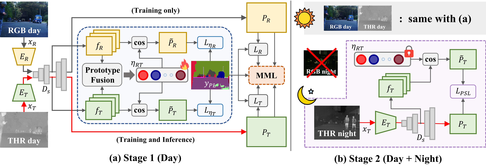

## [ICRA 2025] Boosting Cross-spectral Unsupervised Domain Adaptation for Thermal Semantic Segmentation

Paper: [[arXiv]](https://arxiv.org/abs/2505.06951)

---


> **Boosting Cross-spectral Unsupervised Domain Adaptation for Thermal Semantic Segmentation**<br>
> Seokjun Kwon* (Sejong Univ.), Jeongmin Shin* (Sejong Univ.), Namil Kim (NAVER LABS), Soonmin Hwang (Hanyang Univ.), and Yukyung Choi† (Sejong Univ.)
> 
>
> **Abstract:** *In autonomous driving, thermal image semantic segmentation has emerged as a critical research area, owing to its ability to provide robust scene understanding under adverse visual conditions. In particular, unsupervised domain adaptation (UDA) for thermal image segmentation can be an efficient solution to address the lack of labeled thermal datasets. Nevertheless, since these methods do not effectively utilize the complementary information between RGB and thermal images, they significantly decrease performance during domain adaptation. In this paper, we present a comprehensive study on cross-spectral UDA for thermal image semantic segmentation. We first propose a novel masked mutual learning strategy that promotes complementary information exchange by selectively transferring results between each spectral model while masking out uncertain regions. Additionally, we introduce a novel proto typical self-supervised loss designed to enhance the performance of the thermal segmentation model in nighttime scenarios. This approach addresses the limitations of RGB pre-trained networks, which cannot effectively transfer knowledge under low illumination due to the inherent constraints of RGB sensors. In experiments, our method achieves higher performance over previous UDA methods and comparable performance to state of-the-art supervised methods.*

---

## Prerequisites
### Recommended Environment
- OS: Ubuntu 18.04
- CUDA: 11.6
- Python 3.7
- Pytorch 1.12.1 Torchvision 0.13.1
- GPU: 2 NVIDIA GeForce RTX 3090 GPUs

## Data Preparation
### Downloading the Dataset
- [MF Dataset](https://www.mi.t.u-tokyo.ac.jp/static/projects/mil_multispectral/)
- [KP Dataset](https://github.com/yeong5366/MS-UDA?tab=readme-ov-file)
     - MS-UDA manually annotated the [KAIST PD Dataset](https://soonminhwang.github.io/rgbt-ped-detection/) for the semantic segmentation task.
         - 950 images with the same 19 class ground-truth labels as Cityscapes
     - [CRM_Seg](https://sites.google.com/view/crm4rgbtseg/) divided 950 annotated images into 499, 140, and 311 for training, validation, and testing, respectively.
         - We follow this setting for a fair comparison.
         - Please refer ```./data/KPdataset/filenames_KP/CRM_split``` in our repository.
### Data Folder Structure
- Place the downloaded dataset and the '**CRM_split**' folder in the structure below.
```
data
├── KPdataset
│   ├── day2night
│   │   ├── set00_V000_I00000_2N.png
│   │   └── ...
│   ├── filename_KP
│   │   ├── CRM_split
│   │   ├── 00001D.png
│   │   └── ...
│   ├── labels
│   ├── pseudo_KP
│   └── ...
├── MFdataset
│   ├── images
│   │   ├── 00001D.png
│   │   └── ...
│   ├── labels
│   │   ├── 00001D.png
│   │   └── ...
│   ├── pseudo_all
│   ├── seperated_images
│   │   ├── 00001D_rgb.png
│   │   ├── 00001D_th.png
│   │   └── ...
│   ├── train.txt
│   ├── test.txt
│   └── ...
├── datasets
loss
model
```

## Train
- Modify the path of the config file in the .sh file. (MFdataset or KPdataset)
```
bash scripts/train_stage1.sh
bash scripts/train_stage2.sh
```
## Test
- Modify the path of the config file in the .sh file. (MFdataset or KPdataset)
- Use ```--test_mode``` argument
```
bash scripts/eval_test.sh
```

### Checkpoints
- MFdatsaet
- [KPdataset](https://drive.google.com/drive/folders/1Uf4YeDjFB1eCtMv3BWcqOU_cgfRi1ozT?usp=drive_link)

### References
We referenced the repositories below for the code.
- [MS-UDA](https://github.com/yeong5366/MS-UDA)
- [HeatNet](https://github.com/jzuern/heatnet-pub)
